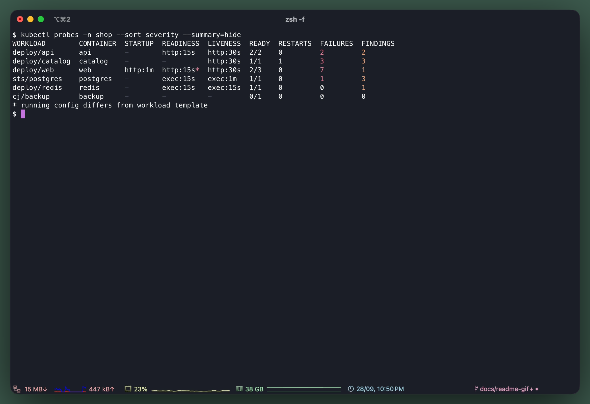
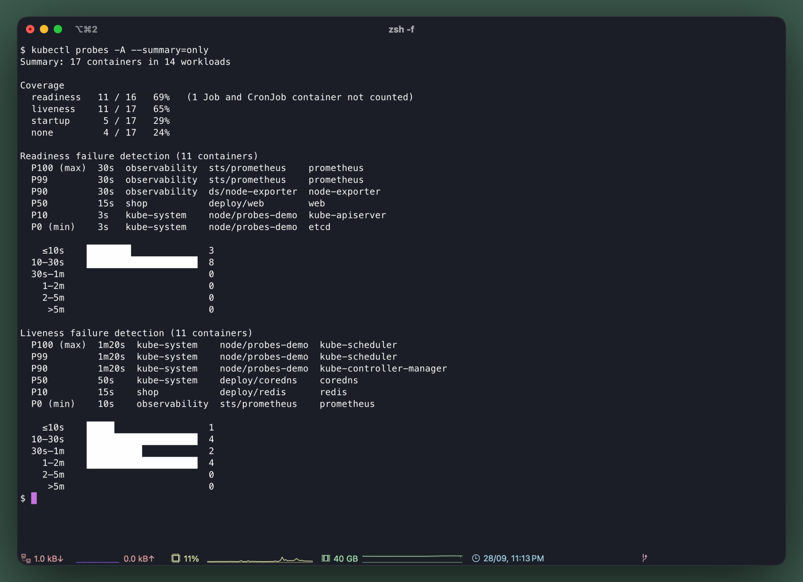
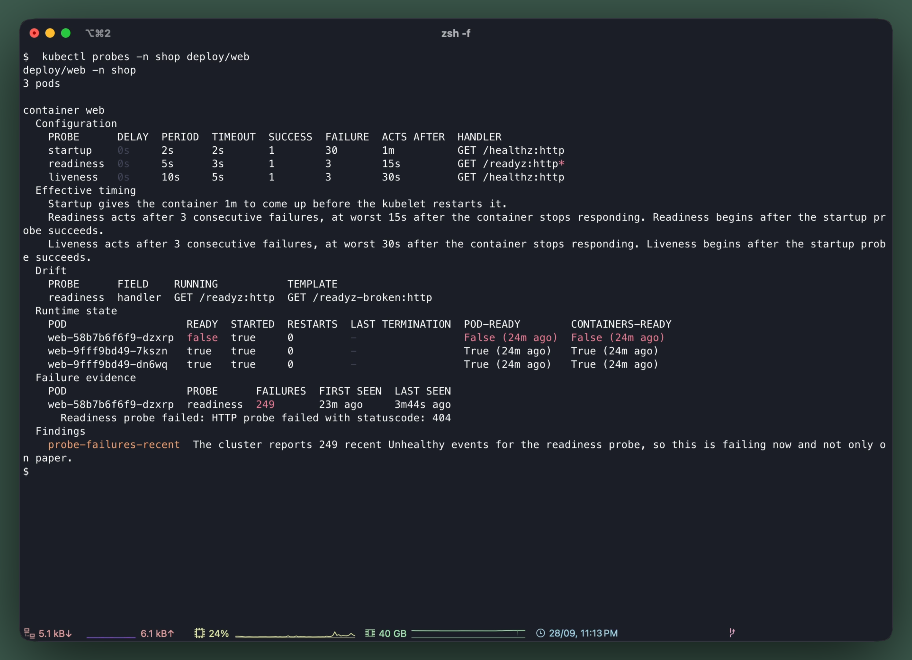
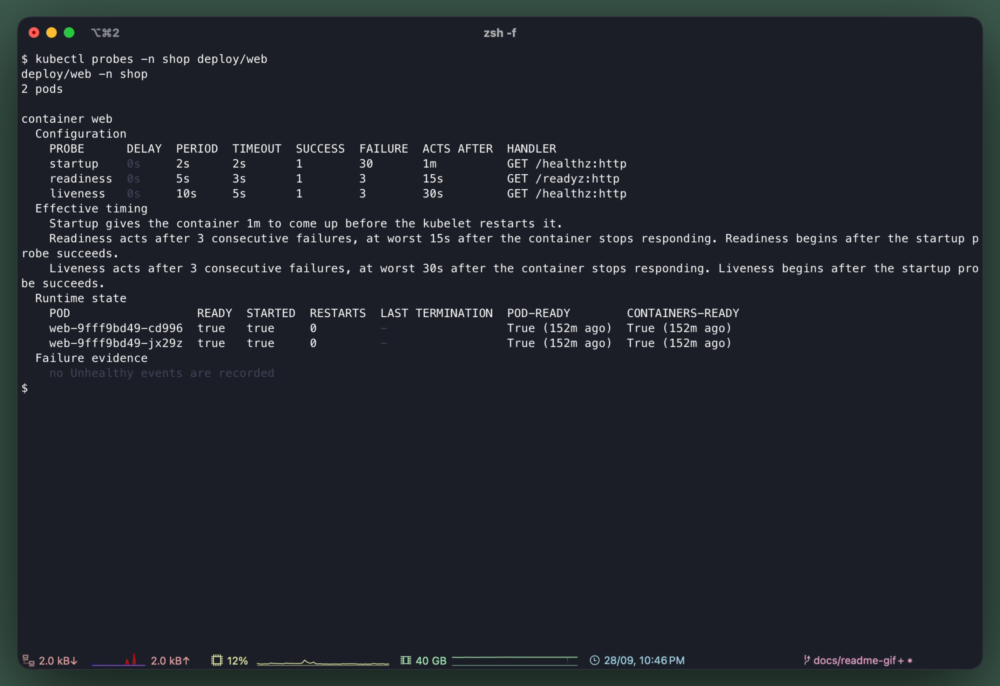
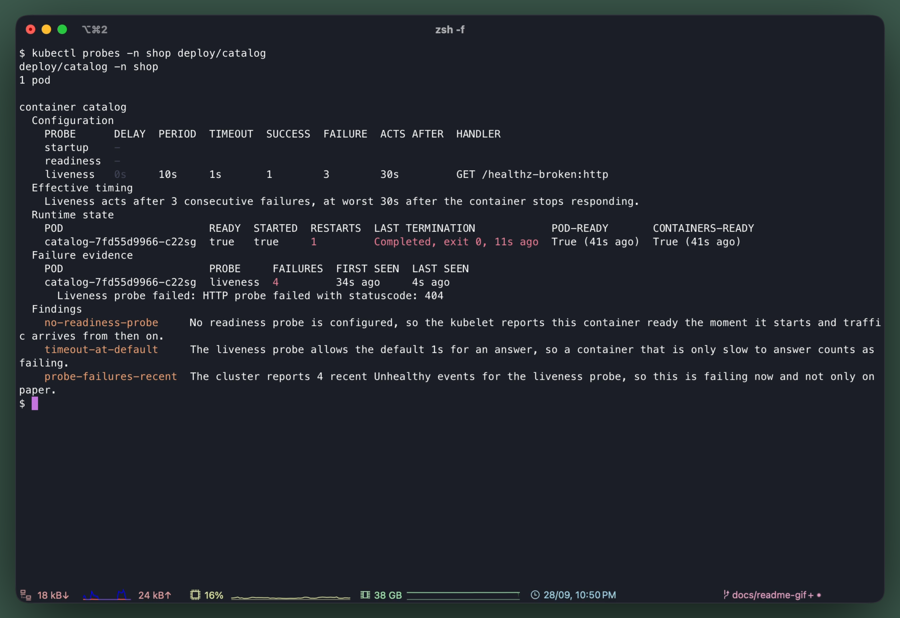
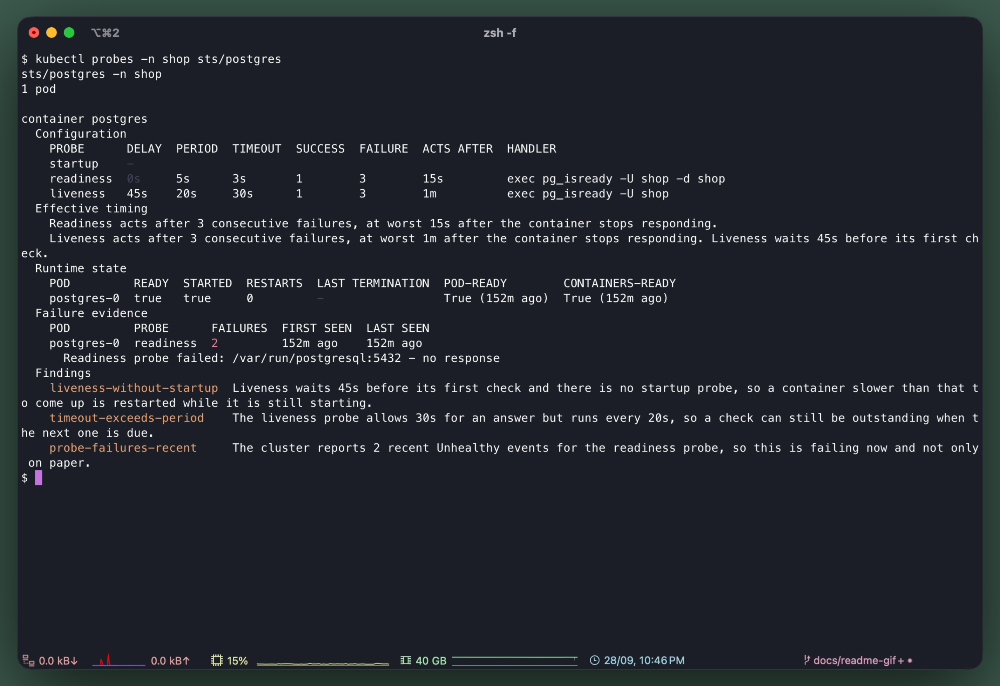
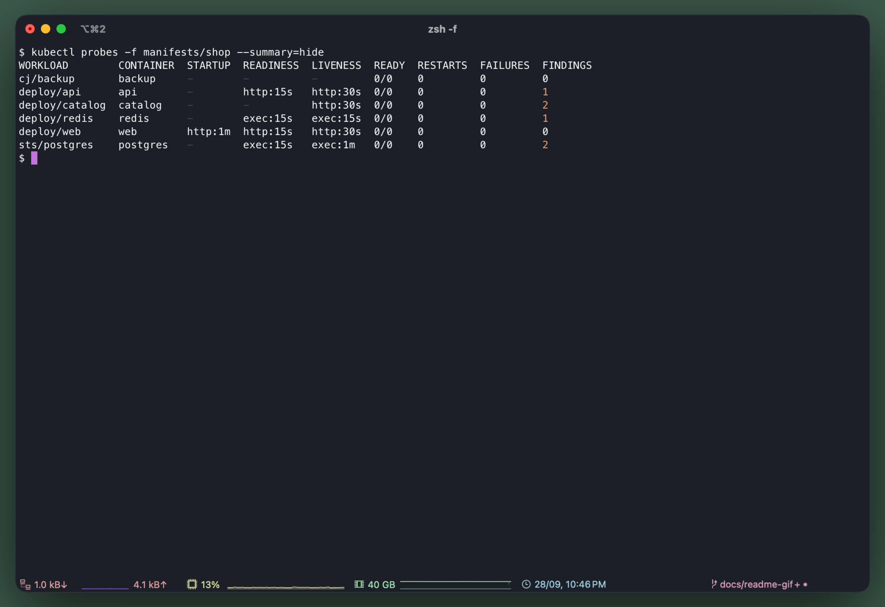
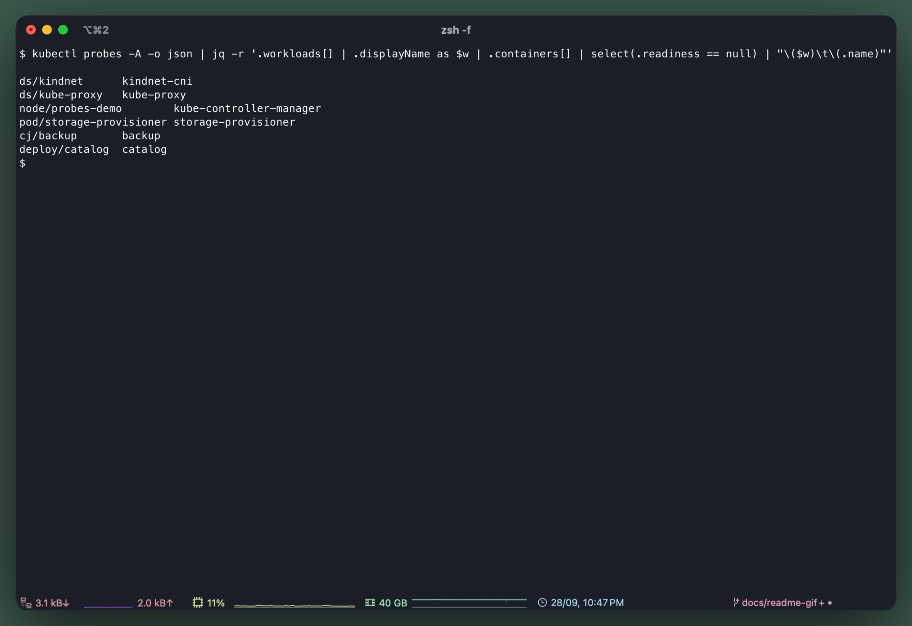

# kubectl probes

[](https://github.com/mertdotcc/kubectl-probes/releases/latest)
[](https://github.com/mertdotcc/kubectl-probes/stargazers)
[](https://github.com/mertdotcc/kubectl-probes/actions/workflows/ci.yml?query=branch%3Amain)
[](https://github.com/mertdotcc/kubectl-probes/blob/main/go.mod)

A read-only `kubectl` plugin that shows, per workload and container, which startup,
readiness, and liveness probes are configured, what their settings mean in practice, and
what evidence of failure the cluster currently reports. Probe settings are a handful of
numbers whose consequences are not obvious — `periodSeconds: 30` with `failureThreshold: 3`
is 90 seconds of traffic to a container that is already broken — so the plugin does that
arithmetic, fills in the defaults the spec left out, and puts the `Unhealthy` events next
to the configuration that produced them. It never exercises a probe itself.

<picture>
  <source media="(prefers-color-scheme: dark)" srcset="docs/img/probes-dark.gif">
  
</picture>

[popeye](https://github.com/derailed/popeye) and [kube-score](https://github.com/zegl/kube-score)
check whether probes are present and look safe, alongside much else. This plugin looks at
nothing but probes: what their timing adds up to, whether a running pod still matches its
template, and what failures the cluster reports.

## Usage

```sh
kubectl probes                      # every workload in the current namespace
kubectl probes -A -o wide           # every namespace, with handlers and drift
kubectl probes deploy/api           # one workload, in full detail
kubectl probes -f deploy.yaml       # a manifest that has not been applied yet
kubectl probes -A --summary=only    # coverage and failure detection, cluster-wide

# Containers with no readiness probe, anywhere
kubectl probes -A -o json | jq -r '.workloads[] | .displayName as $w
  | .containers[] | select(.readiness == null) | "\($w)\t\(.name)"'
```

> **`-l` matches pod labels, not workload labels.** `kubectl probes -l app=api` finds the
> workloads whose *pods* carry `app=api`, which is usually what you meant but is not what
> `kubectl get deploy -l app=api` does.

## Examples

Every example below is the [demo cluster](hack/demo-cluster/) in this repository, running on
minikube: first as `make up` leaves it, then after `make chaos` has broken two probes on
purpose. `web`'s readiness probe and `catalog`'s liveness probe now ask for a path that
answers 404.

### The overview, worst first



One row per container. Each probe column is the handler and the one duration that probe is
read for, and `--sort severity` puts the containers with probe failures first, then the
ones that have restarted, then the ones only a rule has an opinion about.

Two rows are worth a look. `web` runs three pods where it asks for two, one of them not
ready, and its readiness column carries a `*`: the running pods no longer match their own
template. `catalog` has restarted.

### The Summary

Unless `--summary=hide` says otherwise, the table is followed by a Summary: how many
containers have each probe, and how long a failing container goes unnoticed, with the
container at each percentile named so an outlier is one command away. `--summary=only`
prints it alone, here across the whole cluster, control plane included:



### A rollout that stalled without a restart



Changing `web`'s readiness path started a rollout. The new pod runs the new probe, fails
it, and never becomes ready, so the rollout stops there and the two old pods keep serving
on the old one. Twenty-four minutes and 249 failures later nothing has restarted, and
`kubectl get deploy web` still reports `2/2`.

Naming the workload puts the pieces side by side. The `*` on the readiness handler and the
Drift table say what changed: `/readyz` in the running pods, `/readyz-broken` in the
template. The runtime state names the one pod that is not ready, and the failure evidence
carries the kubelet's own message: status code 404.

<details>
<summary>The same workload before <code>make chaos</code></summary>



Probes done well. A startup probe gives the boot a minute, readiness and liveness check
different endpoints, and every timeout is written out. There are no findings.

</details>

### A liveness probe restarting its container



`catalog`'s liveness probe fails three times in a row, 30s at worst, and the kubelet
restarts the container. The last termination reads `Completed, exit 0`: a container stopped
by its liveness probe can shut down cleanly, and nothing in how it exited says why. The
failure evidence does. It names the liveness probe and the 404 it got.

The first two findings were there before anything broke: without a readiness probe the
container counts as ready the moment it starts, and its liveness probe gives it the default
1s to answer.

### Findings on a pod that looks healthy



`postgres` is ready and has never restarted. The findings are about its configuration:
liveness waits a fixed 45s where a startup probe would measure when Postgres is actually
up, and its 30s timeout is longer than its 20s period, so a check can still be outstanding
when the next one is due. The two readiness failures were recorded while it started, 152
minutes earlier. The demo cluster keeps events for a day rather than the API server's
default hour, which is why they still count.

### Before it is applied



`-f` reads manifests instead of the cluster, the same files `kubectl apply -f` would take,
so the configuration findings are there before anything runs. With no pods behind them,
every workload is `0/0` and there is no failure evidence to count.

### In a script



`-o json` and `-o yaml` print the same report as data. This is the query from
[Usage](#usage): every container in the cluster without a readiness probe. The control
plane's static pods appear as `node/<name>` and a pod with no owner as `pod/<name>`, so
nothing that runs is left out.

## Installation

Download the archive for your platform from
[Releases](https://github.com/mertdotcc/kubectl-probes/releases), unpack it, and put the
`kubectl-probes` binary on your `PATH`.

With [krew](https://krew.sigs.k8s.io/), once the plugin is listed in krew-index:
`kubectl krew install probes`

`go install github.com/mertdotcc/kubectl-probes@latest` works too, but krew cannot upgrade
a binary it did not install.

## Trying it on a real cluster

[`hack/demo-cluster/`](hack/demo-cluster/) ships a local cluster to try it on: three
nodes, a small system running on them, and probe configuration chosen so every rule has
something to fire on. It runs on [kind](https://kind.sigs.k8s.io/) or
[minikube](https://minikube.sigs.k8s.io/), and both are supported.

```sh
cd hack/demo-cluster
make up                  # or: make up TOOL=minikube
make probes
```

`kubectl` and `kind` or `minikube` are the only tools it needs. `make chaos` breaks
probes on purpose when you want failure evidence to look at, and is how the
[examples](#examples) above were made. The plugin itself is not tied to either: it reads
whatever cluster your kubeconfig points at.

## Flags

- `-A`, `--all-namespaces` — every namespace, with a `NAMESPACE` column.
- `-n`, `--namespace` — the namespace to read, as everywhere else in `kubectl`.
- `-l`, `--selector` — label selector, matched against pod labels.
- `-f`, `--filename` — read workloads from manifests instead of the cluster. Repeatable.
- `-o`, `--output` — `table` (default), `wide`, `json`, or `yaml`.
- `--sort` — `name` (default) or `severity`, which puts the rows worth looking at first.
- `--summary` — `show` (default) prints the Summary after the table, `only` prints it
  alone, and `hide` leaves it out. It means the same in `-o json` and `-o yaml`. Naming a
  single workload never prints one.
- `--no-findings` — facts only, in every output format.
- `-c`, `--color` — `auto` (default), `always`, or `never`.
- `-v` — client-go log verbosity, for when a read did not return what you expected.

The usual `kubectl` connection flags (`--context`, `--kubeconfig`, `--as`, …) work too.

## How to read the output

Each probe column holds the handler type and the one duration that probe is read for,
computed from the *effective* configuration: the spec with the kubelet's defaults
(`periodSeconds: 10`, `timeoutSeconds: 1`, `failureThreshold: 3`, and the rest) filled in.

- **`STARTUP`** is the startup budget, `initialDelaySeconds + periodSeconds × failureThreshold`:
  everything the container is allowed before the kubelet gives up and restarts it.
- **`READINESS`** and **`LIVENESS`** are the failure detection time, `periodSeconds × failureThreshold`:
  the worst case between a container going bad and the probe acting on it. Both are counted
  from the startup probe succeeding where there is one, since neither runs before then.
- **`*`** marks drift: the running pod's spec differs from its workload's pod template.
  Normal mid-rollout, worth a look afterwards. `-o wide` names the drifted probes, and the
  detailed view puts the `*` on each field that drifted and prints both sides of it.
- **`-`** in a probe column means no probe is configured. In `FAILURES` it means the count
  is unknown because listing events was forbidden, which is not the same as zero.
- **`READY`** is ready pods over total pods. `0/0` is a workload with no pods, read from
  its pod template alone.
- **`WORKLOAD`** is the pods' top-most owner, found by following `ownerReferences`: a
  ReplicaSet folds into its Deployment and a Job into its CronJob, a custom owner such as
  an Argo Rollout is named by its resource (`rollout.argoproj.io/checkout`), a static pod
  shows as `node/<name>`, and a pod with no owner as `pod/<name>`.

> **`FAILURES` is recent history only.** It counts `Unhealthy` events, and the API server
> keeps those about an hour by default. Zero means nothing has failed recently, not that
> nothing has ever failed.

## Findings

Alongside the facts it reads, the plugin reports **findings**: named, opinionated
observations about a container's probe configuration and history.
[`docs/rules.md`](docs/rules.md) lists every rule, what makes it fire, and what it says.
Findings are always printed apart from the facts, and `--no-findings` leaves them out
entirely.

> **The report schema is `probes.kubectl.dev/v1alpha1` and may still change.** `-o json`
> and `-o yaml` carry `apiVersion` and `kind` so a script can tell when it moves. Key on a
> finding's `rule`, which is part of the schema; the `message` is prose and may be reworded.

## License

Apache 2.0. See [LICENSE](LICENSE).
